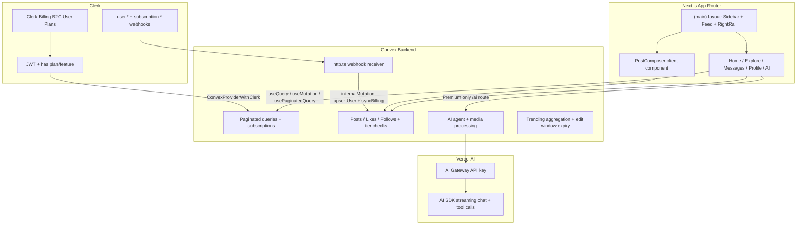
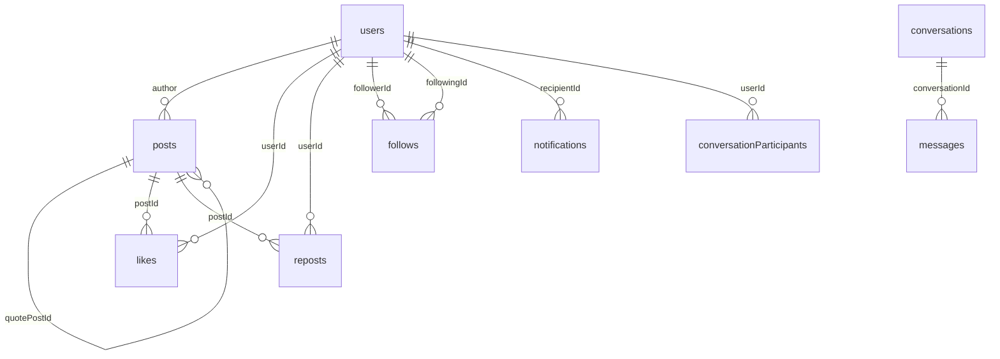

# Asocial Production Architecture Plan

## Current Baseline

The repo is a **nextjs-clerk Convex starter** with:
- Routes: `/`, `/server`, `/sign-in`, `/sign-up` only ([app/](app/))
- Schema: single `numbers` demo table ([convex/schema.ts](convex/schema.ts))
- Auth: Clerk JWT wired in [convex/auth.config.ts](convex/auth.config.ts) + [components/ConvexClientProvider.tsx](components/ConvexClientProvider.tsx)
- **Missing**: shadcn/ui (mandatory for all UI), social schema, webhooks, feed UI, AI, premium logic

Reference UI: three-column X layout (left nav, center feed, right search/trends) from your screenshot. **All visual and interactive UI must be built with shadcn/ui components** (Radix primitives + Tailwind), not ad-hoc HTML/CSS, except where Clerk provides its own components (`<SignIn />`, `<PricingTable />`, `<UserProfile />`).

---

## System Architecture



**Data flow principles**
- **Convex is source of truth** for all social data (posts, graph, DMs, notifications).
- **Clerk Billing is source of truth** for subscription state; **Clerk `has({ feature })` / `has({ plan })`** gates Next.js routes and UI; **Convex `users.subscriptionTier`** is a mirrored cache for backend mutation enforcement.
- **No global Redux/Zustand for server data** — Convex reactive queries handle real-time state.
- **Minimal client state** only for UI ephemera (composer drafts, scroll position, modal open state).

---

## I. Next.js App Router Structure

Replace the demo home page with a route-group shell matching the X layout.

```
app/
├── layout.tsx                          # Root: ClerkProvider → ConvexClientProvider
├── globals.css                         # Tailwind v4 + shadcn CSS vars
├── (auth)/
│   ├── sign-in/[[...sign-in]]/page.tsx
│   └── sign-up/[[...sign-up]]/page.tsx
├── (main)/
│   ├── layout.tsx                      # 3-column shell (sidebar | outlet | right-rail)
│   ├── page.tsx                        # Home → For You feed (default)
│   ├── home/
│   │   └── following/page.tsx          # Following timeline (chronological)
│   ├── explore/page.tsx                # Search + trending
│   ├── notifications/page.tsx
│   ├── bookmarks/page.tsx
│   ├── messages/
│   │   ├── page.tsx                    # Conversation list
│   │   └── [conversationId]/page.tsx   # Live DM thread
│   ├── [username]/
│   │   ├── page.tsx                    # Profile + user posts
│   │   └── status/[postId]/page.tsx    # Thread view (parent chain + replies)
│   ├── compose/page.tsx                # Optional full-page composer
│   ├── settings/page.tsx
│   ├── pricing/page.tsx                # Clerk <PricingTable /> upgrade flow
│   ├── billing/
│   │   └── success/page.tsx            # Post-checkout redirect + session refresh
│   └── ai/
│       └── page.tsx                      # Premium AI chat (Grok equivalent)
├── api/
│   ├── webhooks/
│   │   └── clerk/route.ts              # verifyWebhook: user + billing lifecycle events
│   └── ai/
│       └── chat/route.ts               # Streaming AI route (Vercel AI SDK + Gateway)
└── proxy.ts                            # Public: /sign-in, /sign-up, /api/webhooks/*; protect (main)/*
```

### Layout composition (shadcn-backed)

| Layer | shadcn components | Responsibility |
|-------|-------------------|----------------|
| `app/(main)/layout.tsx` | `Separator`, `Sheet` (mobile nav) | Auth gate, 3-column shell |
| `components/shell/AppSidebar.tsx` | `Button`, `Tooltip`, `Avatar`, `DropdownMenu` | Nav links, Post button, user menu |
| `components/shell/RightRail.tsx` | `Input`, `Card`, `ScrollArea`, `Badge` | Search, trends, who-to-follow |
| `components/feed/FeedTabs.tsx` | `Tabs`, `TabsList`, `TabsTrigger` | For You / Following toggle |
| `components/feed/PostComposer.tsx` | `Textarea`, `Button`, `Progress`, `Popover` | Tier char limit, media attach |
| `components/feed/PostCard.tsx` | `Card`, `Avatar`, `Button`, `DropdownMenu`, `Tooltip` | Post + like/repost/bookmark |
| `components/feed/InfiniteFeed.tsx` | `Skeleton`, `ScrollArea` | Paginated feed + loading states |

**Server vs Client split**
- **Server Components**: profile metadata, thread initial SSR preload via `preloadQuery`, SEO for public profiles.
- **Client Components**: all interactive feed, composer, DMs, optimistic interactions, AI chat stream — **composed from shadcn/ui**.

---

## I-B. Design System — shadcn/ui (Mandatory)

**Rule:** Use shadcn/ui for every applicable UI surface. Do not hand-roll buttons, inputs, dialogs, menus, tabs, or cards. Extend shadcn components in `components/` when Asocial-specific styling is needed (e.g. `PostCard` wraps shadcn `Card`).

### Bootstrap (Phase 1, first task)

```bash
# Non-interactive init — Radix base (required for AI Elements compatibility)
npx shadcn@latest init -d --base radix

# Core shell + feed components
npx shadcn@latest add button avatar dropdown-menu dialog tabs scroll-area \
  textarea badge skeleton tooltip input separator card popover sonner \
  sheet command toggle progress alert alert-dialog

# Phase 2+ additions
npx shadcn@latest add hover-card context-menu pagination switch label form
```

Creates:
- [components.json](components.json) — shadcn config (Tailwind v4, `@/` aliases)
- [lib/utils.ts](lib/utils.ts) — `cn()` helper (`clsx` + `tailwind-merge`)
- [components/ui/*](components/ui/) — owned component source (customizable)

Merge shadcn CSS variables into [app/globals.css](app/globals.css) (keep existing `@theme inline` + dark mode).

### X-inspired theme tokens

Map the screenshot aesthetic to shadcn theme variables in `globals.css`:

| Token | X-like usage |
|-------|----------------|
| `--primary` | Tweet/Post button blue |
| `--border` | Feed dividers between posts |
| `--muted` | Timestamps, secondary text |
| `--radius` | Rounded-full buttons, rounded-2xl composer |
| `--background` / `--foreground` | Light/dark feed background |

Use `npx shadcn@latest init --preset <code> -f` if a preset matches; otherwise customize after init.

### Component mapping by feature

| Feature area | shadcn components | Custom wrapper |
|--------------|-------------------|----------------|
| **Shell / nav** | `Button`, `Tooltip`, `Sheet`, `Separator` | `AppSidebar`, `MobileNav` |
| **Feed** | `Tabs`, `Card`, `Skeleton`, `ScrollArea` | `FeedTabs`, `InfiniteFeed`, `PostCard` |
| **Composer** | `Textarea`, `Button`, `Progress`, `Popover` | `PostComposer`, `CharCounter` |
| **Interactions** | `Button` (ghost/icon), `Toggle`, `Tooltip` | `LikeButton`, `RepostButton` |
| **Thread view** | `Card`, `Separator`, `ScrollArea` | `ThreadChain`, `ReplyList` |
| **Profile** | `Avatar`, `Tabs`, `Button`, `Badge` | `ProfileHeader`, `FollowButton` |
| **Notifications** | `ScrollArea`, `Badge`, `Avatar`, `Button` | `NotificationItem` |
| **Explore / search** | `Input`, `Command`, `Card`, `Badge` | `SearchBar`, `TrendList` |
| **DMs** | `ScrollArea`, `Input`, `Textarea`, `Avatar`, `Sheet` | `ConversationList`, `MessageBubble` |
| **Media grid** | `AspectRatio`, `Dialog` (lightbox) | `PostMediaGrid` |
| **Settings / billing** | Clerk `<UserProfile />` + shadcn `Card` wrapper | `SettingsLayout` |
| **Pricing** | Clerk `<PricingTable />` + shadcn `Card`/`Separator` layout | `PricingPage` |
| **AI chat** | `ScrollArea`, `Textarea`, `Button`, `Card`, `Skeleton` | `AIChatPanel`, `AIMessage` |
| **Premium badge** | `Badge` + Clerk `<Show>` | `VerifiedBadge` |
| **Toasts / errors** | `sonner` (`toast.success/error`) | Global in root layout |
| **Confirmations** | `AlertDialog` | Delete post, unfollow |
| **Loading states** | `Skeleton` | Feed, profile, thread placeholders |
| **Empty states** | `Card` + `Button` CTA | No posts, no notifications |

### Composition rules

1. **Import from `@/components/ui/*`** — never duplicate Radix logic in feature components.
2. **Use `cn()`** for conditional classes on shadcn components.
3. **Icon set:** `lucide-react` only (shadcn default) — Home, Search, Bell, Mail, etc. for sidebar.
4. **Clerk exceptions:** Keep `<SignIn />`, `<SignUp />`, `<UserButton />`, `<PricingTable />`, `<UserProfile />` as Clerk-provided; wrap in shadcn layout containers only.
5. **No inline `<button>` / raw `<input>`** in feature components unless no shadcn equivalent exists.
6. **Responsive:** `Sheet` for mobile sidebar; `DropdownMenu` for post actions (⋯ menu).
7. **Accessibility:** shadcn/Radix handles focus traps, ARIA — do not bypass with custom div-buttons.

### File structure

```
components/
├── ui/                    # shadcn primitives (CLI-generated, owned)
│   ├── button.tsx
│   ├── card.tsx
│   └── ...
├── shell/                 # App chrome (uses ui/*)
├── feed/
├── profile/
├── messages/
├── explore/
├── ai/
└── ConvexClientProvider.tsx
```

### When shadcn does NOT apply

- Clerk auth/billing embedded components (listed above)
- Convex/Clerk provider wrappers
- Pure layout wrappers with no interactive primitives

Everything else — **shadcn first**.

---

## II. Complete Convex Database Schema

Replace [convex/schema.ts](convex/schema.ts) demo table with the following. Denormalized counts are maintained in mutations for read performance (standard X/Twitter pattern).

```typescript
// convex/schema.ts (architectural definition)

users: defineTable({
  clerkId: v.string(),
  username: v.string(),           // unique handle
  displayName: v.string(),
  bio: v.optional(v.string()),
  location: v.optional(v.string()),
  website: v.optional(v.string()),
  avatarUrl: v.optional(v.string()),
  bannerUrl: v.optional(v.string()),
  subscriptionTier: v.union(v.literal("free"), v.literal("premium")),
  planSlug: v.optional(v.string()),              // Clerk Billing plan slug e.g. "premium"
  subscriptionStatus: v.optional(v.string()),   // active | past_due | canceled | ended
  clerkSubscriptionId: v.optional(v.string()),
  subscriptionUpdatedAt: v.optional(v.number()),
  joinedAt: v.number(),
  followerCount: v.number(),
  followingCount: v.number(),
  postCount: v.number(),
})
  .index("by_clerkId", ["clerkId"])
  .index("by_username", ["username"])
  .searchIndex("search_username", { searchField: "username" })
  .searchIndex("search_displayName", { searchField: "displayName" }),

posts: defineTable({
  authorId: v.id("users"),
  content: v.string(),
  mediaIds: v.optional(v.array(v.id("_storage"))),
  mediaLayout: v.optional(v.union(
    v.literal("single"), v.literal("grid2"), v.literal("grid3"), v.literal("grid4"), v.literal("video")
  )),
  parentPostId: v.optional(v.id("posts")),      // reply
  rootPostId: v.optional(v.id("posts")),         // thread root (denormalized)
  quotePostId: v.optional(v.id("posts")),       // quote tweet
  viewCount: v.number(),
  likeCount: v.number(),
  repostCount: v.number(),
  replyCount: v.number(),
  bookmarkCount: v.number(),
  hashtags: v.array(v.string()),                 // normalized lowercase
  mentionUserIds: v.array(v.id("users")),
  isAiGenerated: v.optional(v.boolean()),        // @AsocialAI replies
  editedAt: v.optional(v.number()),
  createdAt: v.number(),
})
  .index("by_author_created", ["authorId", "createdAt"])
  .index("by_parent_created", ["parentPostId", "createdAt"])
  .index("by_root_created", ["rootPostId", "createdAt"])
  .index("by_created", ["createdAt"])
  .searchIndex("search_content", { searchField: "content", filterFields: ["authorId"] }),

likes: defineTable({ userId: v.id("users"), postId: v.id("posts"), createdAt: v.number() })
  .index("by_user_post", ["userId", "postId"])
  .index("by_post", ["postId"]),

reposts: defineTable({ userId: v.id("users"), postId: v.id("posts"), createdAt: v.number() })
  .index("by_user_post", ["userId", "postId"])
  .index("by_post", ["postId"])
  .index("by_user_created", ["userId", "createdAt"]),

bookmarks: defineTable({ userId: v.id("users"), postId: v.id("posts"), createdAt: v.number() })
  .index("by_user_created", ["userId", "createdAt"])
  .index("by_user_post", ["userId", "postId"]),

follows: defineTable({ followerId: v.id("users"), followingId: v.id("users"), createdAt: v.number() })
  .index("by_follower_following", ["followerId", "followingId"])
  .index("by_follower", ["followerId"])
  .index("by_following", ["followingId"]),

notifications: defineTable({
  recipientId: v.id("users"),
  actorId: v.id("users"),
  type: v.union(v.literal("mention"), v.literal("reply"), v.literal("like"), v.literal("repost"), v.literal("follow")),
  postId: v.optional(v.id("posts")),
  read: v.boolean(),
  createdAt: v.number(),
})
  .index("by_recipient_created", ["recipientId", "createdAt"])
  .index("by_recipient_unread", ["recipientId", "read"]),

conversations: defineTable({
  participantIds: v.array(v.id("users")),        // sorted pair for 1:1 dedup
  lastMessageAt: v.number(),
  lastMessagePreview: v.optional(v.string()),
})
  .index("by_lastMessageAt", ["lastMessageAt"]),

conversationParticipants: defineTable({
  conversationId: v.id("conversations"),
  userId: v.id("users"),
  lastReadAt: v.number(),
})
  .index("by_user", ["userId"])
  .index("by_conversation_user", ["conversationId", "userId"]),

messages: defineTable({
  conversationId: v.id("conversations"),
  senderId: v.id("users"),
  content: v.string(),
  mediaId: v.optional(v.id("_storage")),
  createdAt: v.number(),
})
  .index("by_conversation_created", ["conversationId", "createdAt"]),

hashtags: defineTable({
  tag: v.string(),                               // normalized
  postCount: v.number(),
  score: v.number(),                             // trending score
  windowStart: v.number(),
})
  .index("by_tag", ["tag"])
  .index("by_score", ["score"]),

feedRankings: defineTable({                      // For You cache (optional Phase 2+)
  userId: v.id("users"),
  postId: v.id("posts"),
  score: v.number(),
  computedAt: v.number(),
})
  .index("by_user_score", ["userId", "score"]),

aiSessions: defineTable({                        // Premium AI chat history
  userId: v.id("users"),
  title: v.optional(v.string()),
  createdAt: v.number(),
  updatedAt: v.number(),
})
  .index("by_user_updated", ["userId", "updatedAt"]),

aiMessages: defineTable({
  sessionId: v.id("aiSessions"),
  role: v.union(v.literal("user"), v.literal("assistant")),
  content: v.string(),
  createdAt: v.number(),
})
  .index("by_session_created", ["sessionId", "createdAt"]),
```

### Entity relationships



---

## III. Convex Functions Organization

```
convex/
├── schema.ts
├── auth.config.ts
├── http.ts                         # Clerk webhook endpoint
├── crons.ts                        # Trending refresh, optional feed ranking
├── lib/
│   ├── auth.ts                     # requireAuth(), getCurrentUser(), requirePremium()
│   ├── tiers.ts                    # char limits, edit window, badge helpers
│   ├── notifications.ts            # createNotification() internal helper
│   ├── hashtags.ts                 # extract + upsert hashtags from post content
│   └── validators.ts               # shared v.object schemas
├── users/
│   ├── queries.ts                  # getByUsername, searchUsers, getCurrent
│   └── mutations.ts                # updateProfile (internal via webhook too)
├── posts/
│   ├── queries.ts                  # getThread, getById, getProfilePosts
│   ├── mutations.ts                # create, edit (premium), delete
│   └── feeds.ts                    # forYouFeed, followingFeed (paginated)
├── interactions/
│   └── mutations.ts                # toggleLike, toggleRepost, toggleBookmark, toggleFollow
├── notifications/
│   └── queries.ts                  # listNotifications (paginated)
├── messages/
│   ├── queries.ts                  # listConversations, listMessages
│   └── mutations.ts                # sendMessage, markRead, startConversation
├── explore/
│   └── queries.ts                  # trendingTopics, searchPosts, searchHashtags
├── media/
│   └── mutations.ts                # generateUploadUrl
├── ai/
│   ├── actions.ts                  # generateReply, summarizeThread, chat (calls AI Gateway)
│   ├── mutations.ts                # createAiSession, saveMessage, triggerMentionReply
│   └── queries.ts                  # listSessions, getSessionMessages
└── webhooks/
    └── clerk.ts                    # internalMutation: upsertUser from Clerk payload
```

### Key query patterns

| Feature | Convex API | Pagination |
|---------|-----------|------------|
| For You feed | `posts.feeds.forYouFeed` | `usePaginatedQuery`, mixed: followed + ranked + recency |
| Following feed | `posts.feeds.followingFeed` | Strict chronological from `follows` graph |
| Thread view | `posts.queries.getThread` | Parent chain walk + paginated replies by `rootPostId` |
| Profile posts | `posts.queries.getByUsername` | Paginated by `by_author_created` |
| DMs | `messages.queries.listMessages` | Real-time subscription on conversation |
| Explore | `explore.queries.trendingTopics` | Cron-updated `hashtags` table |

### Clerk webhook sync — dual endpoint strategy

**Recommended split** (per [Clerk Billing webhooks docs](https://clerk.com/docs/nextjs/guides/development/webhooks/billing)):

| Endpoint | Events | Why |
|----------|--------|-----|
| `app/api/webhooks/clerk/route.ts` | `user.*`, `subscription.*`, `subscriptionItem.*`, `paymentAttempt.*` | Next.js `verifyWebhook` from `@clerk/nextjs/webhooks` is the documented path for billing payloads |
| Convex `internalMutation` | Called from webhook handler | Keeps DB writes in Convex |

```
POST /api/webhooks/clerk
  → verifyWebhook(req)  // requires CLERK_WEBHOOK_SIGNING_SECRET
  → user.created / user.updated:
      convex.users.upsertFromClerk({ clerkId, username, displayName, avatarUrl })
  → subscription.created / subscription.active / subscription.updated:
      convex.users.syncBillingFromClerk({
        clerkId: payer.user_id,
        planSlug: items[0].plan.slug,
        status: evt.data.status,
        subscriptionId: evt.data.id,
      })
  → subscriptionItem.canceled / subscriptionItem.ended:
      downgrade to free_user plan slug → subscriptionTier: "free"
```

**Important payload rules** (from Clerk docs):
- Plan slug lives at `evt.data.items[i].plan.slug` (subscription events), not top-level.
- Payer is `evt.data.payer.user_id` (B2C), not `org_id`.
- There is **no** `subscription.canceled` event — cancellations fire as `subscriptionItem.canceled`.
- Clerk event names use dot-notation (`subscriptionItem.canceled`), **not** Stripe names.

Update [proxy.ts](proxy.ts) to mark webhook route public:

```typescript
const isPublicRoute = createRouteMatcher([
  "/sign-in(.*)", "/sign-up(.*)", "/api/webhooks(.*)",
]);
```

---

## IV. Clerk Billing Setup (B2C Premium)

> Clerk Billing is **Beta** — pin `@clerk/nextjs` and `clerk-js` versions to avoid breaking API changes. See [Billing overview](https://clerk.com/docs/guides/billing/overview).

### Dashboard setup checklist

1. **Enable Billing** — [Dashboard → Billing → Settings](https://dashboard.clerk.com/last-active?path=billing/settings) or CLI: `clerk enable billing --for user`
   - Dev: use **Clerk development gateway** (shared test Stripe — no Stripe account needed)
   - Prod: connect your own **Stripe account** (payment processing only; plans live in Clerk, not Stripe Billing)

2. **Create User Plans** — [Dashboard → Billing → Plans → User Plans tab](https://dashboard.clerk.com/last-active?path=billing/plans) (NOT Organization Plans)

| Plan slug | Name | Price | Notes |
|-----------|------|-------|-------|
| `free_user` | Free | $0 | Auto-created when Billing enabled |
| `premium` | Asocial Premium | e.g. $8/mo | Publicly available; optional annual discount |

3. **Attach Features per plan** — Dashboard → Plans → click plan → Features section (features are **per-plan**, not global)

| Feature slug | Free | Premium | Gates |
|--------------|------|---------|-------|
| `long_posts` | no | yes | 4,000 char limit vs 280 |
| `verified_badge` | no | yes | Blue checkmark in UI |
| `edit_posts` | no | yes | 30-min edit window |
| `reply_priority` | no | yes | Boost in thread sort |
| `ai_chat` | no | yes | `/ai` route + full agent |
| `ai_mentions` | no | yes | @AsocialAI automated replies |
| `for_you_boost` | no | yes | Algorithmic feed priority |

4. **Register webhook** — Dashboard → Webhooks → add endpoint `https://your-domain/api/webhooks/clerk`
   - Subscribe to: `user.*`, `subscription.*`, `subscriptionItem.*`
   - Copy **Signing Secret** → `CLERK_WEBHOOK_SIGNING_SECRET` in `.env.local`

5. **Organizations prerequisite** — If Orgs are ever enabled, set **Membership optional** so B2C `<PricingTable />` works for personal accounts ([B2C docs](https://clerk.com/docs/nextjs/guides/billing/for-b2c)).

### Programmatic config (optional, version-controlled)

```bash
clerk auth login && clerk link
clerk config pull --keys billing > billing.json
# Edit plans/features, then:
clerk config patch --file billing.json --dry-run
clerk config patch --file billing.json
```

### UI components

| Component | Route / usage |
|-----------|---------------|
| `<PricingTable />` | [app/(main)/pricing/page.tsx](app/(main)/pricing/page.tsx) — checkout drawer built-in |
| `<PricingTable newSubscriptionRedirectUrl="/billing/success" />` | Post-checkout redirect |
| `<UserProfile />` | [app/(main)/settings/page.tsx](app/(main)/settings/page.tsx) — manage plan, cancel, invoices |
| `<Show when={{ feature: 'ai_chat' }}>` | Gate premium UI blocks |
| `useSubscription()` from `@clerk/nextjs/experimental` | Display renewal date (display only — use `has()` for auth) |

Example pricing page:

```tsx
import { PricingTable } from "@clerk/nextjs";

export default function PricingPage() {
  return (
    <main className="mx-auto max-w-3xl p-6">
      <h1>Asocial Premium</h1>
      <PricingTable newSubscriptionRedirectUrl="/billing/success" />
    </main>
  );
}
```

### Gating pattern — Clerk (UI/routes) + Convex (mutations)

**Next.js — prefer `has({ feature })` over `has({ plan })` for capability gates:**

```typescript
// app/(main)/ai/page.tsx (Server Component)
import { auth } from "@clerk/nextjs/server";
import { redirect } from "next/navigation";

export default async function AIPage() {
  const { has } = await auth();
  if (!has({ feature: "ai_chat" })) redirect("/pricing");
  return <AIChatClient />;
}
```

```tsx
// components/feed/PostComposer.tsx (Client)
import { useAuth } from "@clerk/nextjs";

const { has, isLoaded } = useAuth();
const charLimit = has?.({ feature: "long_posts" }) ? 4000 : 280;
```

```tsx
// components/user/VerifiedBadge.tsx
import { Show } from "@clerk/nextjs";

<Show when={{ feature: "verified_badge" }}>
  <BadgeCheck className="h-4 w-4 text-blue-500" />
</Show>
```

**Convex — enforce on write path** (cannot call Clerk `has()` inside Convex):

```typescript
// convex/lib/tiers.ts
export async function requireFeature(ctx, user, feature: "long_posts" | "edit_posts" | "ai_chat") {
  const tier = user.subscriptionTier; // mirrored from billing webhook
  if (feature === "long_posts" && tier !== "premium") throw new Error("Premium required");
  // ...
}
```

**After checkout:** session JWT must refresh before `has()` returns true. Redirect to `/billing/success` which polls or calls `clerk.session.reload()` until features appear ([known gotcha](https://clerk.com/docs/nextjs/guides/billing/for-b2c)).

### Billing ↔ Convex sync mapping

| Clerk event | Convex `users` update |
|-------------|----------------------|
| `subscription.active` + plan `premium` | `subscriptionTier: "premium"`, `planSlug: "premium"`, `subscriptionStatus: "active"` |
| `subscriptionItem.canceled` / `ended` | `subscriptionTier: "free"`, `planSlug: "free_user"`, `subscriptionStatus: "canceled"` |
| `subscription.pastDue` | `subscriptionStatus: "past_due"` (grace period policy TBD) |

### Env vars (billing)

```
CLERK_WEBHOOK_SIGNING_SECRET=whsec_...
# Existing:
NEXT_PUBLIC_CLERK_PUBLISHABLE_KEY=...
CLERK_SECRET_KEY=...
CLERK_JWT_ISSUER_DOMAIN=...
```

---

## V. State Management Approach

### Layer 1: Server / Real-time state (primary) — Convex

| Concern | Mechanism |
|---------|-----------|
| Feed data | `usePaginatedQuery(api.posts.feeds.forYouFeed, {}, { initialNumItems: 20 })` |
| Live DMs | `useQuery(api.messages.queries.listMessages, { conversationId })` — auto-updates |
| Notifications badge | `useQuery(api.notifications.queries.unreadCount)` |
| Current user profile | `useQuery(api.users.queries.getCurrent)` |
| Auth gate | `useConvexAuth()` (not raw Clerk `useAuth`) for Convex-authenticated UI |

### Layer 2: Optimistic UI — React 19 + Convex mutations

Pattern for likes/reposts/follows:

```typescript
// components/feed/PostCard.tsx (pattern)
import { Button } from "@/components/ui/button";
import { Card } from "@/components/ui/card";
import { toast } from "sonner";

const likePost = useMutation(api.interactions.mutations.toggleLike);
const [optimisticLiked, setOptimisticLiked] = useOptimistic(isLiked);

async function handleLike() {
  setOptimisticLiked(!optimisticLiked);
  try {
    await likePost({ postId });
  } catch {
    toast.error("Failed to like post");
  }
}
```

- **Likes/Reposts/Bookmarks**: optimistic toggle + denormalized counts updated in mutation; query subscription reconciles.
- **Follow**: optimistic `isFollowing` on profile header.
- **New post**: append to local `useOptimistic` list at top of feed until mutation confirms.

### Layer 3: URL state — Next.js navigation

- Feed tab: `/` vs `/home/following`
- Thread: `/[username]/status/[postId]`
- Search: `/explore?q=hashtag`
- DM thread: `/messages/[conversationId]`

### Layer 4: Ephemeral UI state — React Context (no Redux)

Single lightweight context: `ComposerContext` for:
- Draft text (persist to `sessionStorage`)
- Selected media files before upload
- Reply-to / quote-to target post

Optional `UIContext` for sidebar collapse on mobile. **Do not** store feed/post data in Context.

### Layer 5: Auth + tier — Clerk Billing + Convex mirror

```typescript
// UI gating (immediate, session-based)
const { has } = useAuth();
const canEdit = has?.({ feature: "edit_posts" });
const charLimit = has?.({ feature: "long_posts" }) ? 4000 : 280;

// Backend enforcement (mirrored from billing webhooks)
const user = useQuery(api.users.queries.getCurrent);
// user.subscriptionTier === "premium" checked in Convex mutations
```

**Do not** manually set `publicMetadata.subscriptionTier` — Clerk Billing owns plan state via subscriptions and features.

---

## VI. Feature Architecture Details

### Dual timelines

- **Following**: query posts where `authorId IN followingIds`, order by `createdAt desc` — pure index scan.
- **For You (v1)**: blend `(30% following recent) + (40% global engagement-ranked) + (30% recency)` using denormalized `likeCount + repostCount + replyCount` scoring; upgrade to `feedRankings` table + cron in Phase 2.

### Infinite scroll

`InfiniteFeed.tsx` uses `usePaginatedQuery` + `IntersectionObserver` sentinel at bottom. Loading skeletons via shadcn `Skeleton`.

### Threaded replies

- Reply sets `parentPostId` + `rootPostId` (root = parent's root or parent if top-level).
- Thread page: walk `parentPostId` chain upward (max depth cap e.g. 50), paginate replies via `by_root_created`.
- Premium reply sorting: replies from premium authors get `+boost` in sort key.

### Media (1–4 grid + video)

- Upload: `generateUploadUrl` mutation → client PUT → store `_storage` IDs on post.
- UI: `PostMediaGrid.tsx` switches layout by count (`single`, `grid2`, `grid3`, `grid4`, `video`).
- Convex action (optional): generate thumbnails for video.

### Search and explore

- User search: Convex `searchIndex` on `users.search_username`.
- Hashtag search: `hashtags.by_tag` + `posts` filtered by `hashtags` array field.
- Trending: cron every 15min recomputes `hashtags.score` from post velocity in rolling 24h window.

### Real-time DMs

- `messages` table subscription drives live thread.
- `conversationParticipants.lastReadAt` for unread indicators.
- Start conversation: dedup via sorted `participantIds` lookup.

---

## VII. Premium Tier Enforcement (Clerk Billing + Convex)

| Rule | Clerk gate (UI/routes) | Convex gate (mutations) |
|------|------------------------|-------------------------|
| 280 vs 4000 chars | `has({ feature: "long_posts" })` | `requireFeature("long_posts")` |
| Blue checkmark | `<Show when={{ feature: "verified_badge" }}>` | N/A (read from `users.subscriptionTier`) |
| Edit window (30 min) | `has({ feature: "edit_posts" })` | `requireFeature("edit_posts")` + timestamp check |
| Reply priority boost | N/A | `getThread` sort weights `subscriptionTier === "premium"` |
| AI full access | `has({ feature: "ai_chat" })` on `/ai` + API route | `requireFeature("ai_chat")` in actions |
| @AsocialAI mentions | `has({ feature: "ai_mentions" })` on author | Only process mentions from premium authors |
| For You boost | N/A | `forYouFeed` scoring function |

Central helper in [convex/lib/tiers.ts](convex/lib/tiers.ts):

```typescript
export const TIER_LIMITS = {
  free: { maxChars: 280, canEdit: false },
  premium: { maxChars: 4000, canEdit: true, editWindowMs: 30 * 60 * 1000 },
};
// Map Clerk plan slugs → tier
export function planSlugToTier(slug: string): "free" | "premium" {
  return slug === "premium" ? "premium" : "free";
}
```

---

## VIII. AI Agent (Grok Equivalent) — Vercel AI SDK + AI Gateway

### Routes and access

- **UI**: [app/(main)/ai/page.tsx](app/(main)/ai/page.tsx) — gated with `has({ feature: "ai_chat" })`, redirect to `/pricing` if false.
- **Streaming API**: [app/api/ai/chat/route.ts](app/api/ai/chat/route.ts) — `auth()` + `has({ feature: "ai_chat" })` before streaming.
- **Convex actions**: platform-context tools fetch trending topics, thread summaries, user timelines.

### Contextual awareness tools (AI SDK tool calling)

| Tool | Convex source |
|------|---------------|
| `getTrendingTopics` | `explore.queries.trendingTopics` |
| `summarizeThread` | `posts.queries.getThread` |
| `getUserRecentPosts` | `posts.queries.getByUsername` |

### @AsocialAI mention pipeline

1. `posts.mutations.create` detects `@AsocialAI` in content.
2. Schedules `internalAction ai.generateMentionReply({ postId, threadContext })`.
3. Action reads thread via Convex, calls AI Gateway, inserts reply post with `isAiGenerated: true`.
4. Creates notification for original author.

### Env vars to add

```
AI_GATEWAY_API_KEY=...
# Optional model routing via gateway
AI_MODEL=openai/gpt-4o
```

---

## IX. Implementation Phases

### Phase 0 — Clerk Billing (before Premium features)
- Enable Billing in Clerk Dashboard; create `premium` User Plan + feature slugs
- Add `/pricing`, `/billing/success`, `<UserProfile />` in settings
- Implement `app/api/webhooks/clerk/route.ts` with billing event handlers
- Pin `@clerk/nextjs@^7.4.1` (already installed; do not float during Billing beta)

### Phase 1 — Foundation (Week 1)
- **shadcn init + core components** (blocking — all UI work depends on this)
- Build `(main)` three-column shell with shadcn `Sheet`/`Button`/`Tooltip`/`Separator`
- Full schema + Clerk webhook + `users` sync
- Replace demo home with shadcn-based feed (`Tabs`, `Card`, `PostComposer`, `Skeleton`)

### Phase 2 — Social graph and interactions (Week 2)
- Likes, reposts, bookmarks, follows with optimistic UI
- Thread view + replies
- Notifications
- Profile pages

### Phase 3 — Media, explore, DMs (Week 3)
- Media upload + grid layouts
- Hashtags, trending, search
- Real-time messaging

### Phase 4 — Premium + AI (Week 4)
- Wire all feature gates to Clerk Billing slugs
- `/ai` chat route with AI Gateway (premium-gated)
- @AsocialAI automated replies (premium authors only)
- For You ranking v2 with `for_you_boost`

---

## X. Files to Remove / Replace

| Current | Action |
|---------|--------|
| [convex/myFunctions.ts](convex/myFunctions.ts) + `numbers` table | Delete after migration |
| [app/page.tsx](app/page.tsx) demo | Replace with feed shell |
| [app/server/](app/server/) demo | Remove or repurpose for SSR examples |
| [README.md](README.md) merge conflict | Resolve during Phase 1 |

---

## XI. Critical Dependencies to Add

```json
{
  "@ai-sdk/gateway": "latest",
  "ai": "latest",
  "class-variance-authority": "latest",
  "clsx": "latest",
  "tailwind-merge": "latest",
  "lucide-react": "latest",
  "date-fns": "latest",
  "sonner": "latest",
  "@radix-ui/react-*": "installed transitively via shadcn CLI"
}
```

**shadcn/ui** is not an npm dependency — components are copied into `components/ui/` via CLI. Run `npx shadcn@latest add <component>` per phase as needed.

Note: `@clerk/nextjs/webhooks` (`verifyWebhook`) ships with `@clerk/nextjs` — no separate `svix` package required unless you prefer raw Svix verification.

---

## XII. Design System Reference

- [shadcn/ui docs](https://ui.shadcn.com/docs) — component API, theming, Tailwind v4
- [shadcn CLI](https://ui.shadcn.com/docs/cli) — `init`, `add`, presets
- Project config: [components.json](components.json) (created at init)

---

## XIII. Clerk Billing Reference Links

- [Billing overview](https://clerk.com/docs/guides/billing/overview) — Beta notice, Stripe relationship, pricing (0.7% + Stripe fees)
- [B2C SaaS billing (Next.js)](https://clerk.com/docs/nextjs/guides/billing/for-b2c) — Enable Billing, create User Plans, `<PricingTable />`, `has()`
- [Billing webhooks](https://clerk.com/docs/nextjs/guides/development/webhooks/billing) — Event catalog, payload shape
- [Authorization checks](https://clerk.com/docs/guides/secure/authorization-checks) — `has({ feature })` vs `has({ plan })`
- Dashboard: [Billing Settings](https://dashboard.clerk.com/last-active?path=billing/settings) | [Plans](https://dashboard.clerk.com/last-active?path=billing/plans) | [Webhooks](https://dashboard.clerk.com/last-active?path=webhooks)
